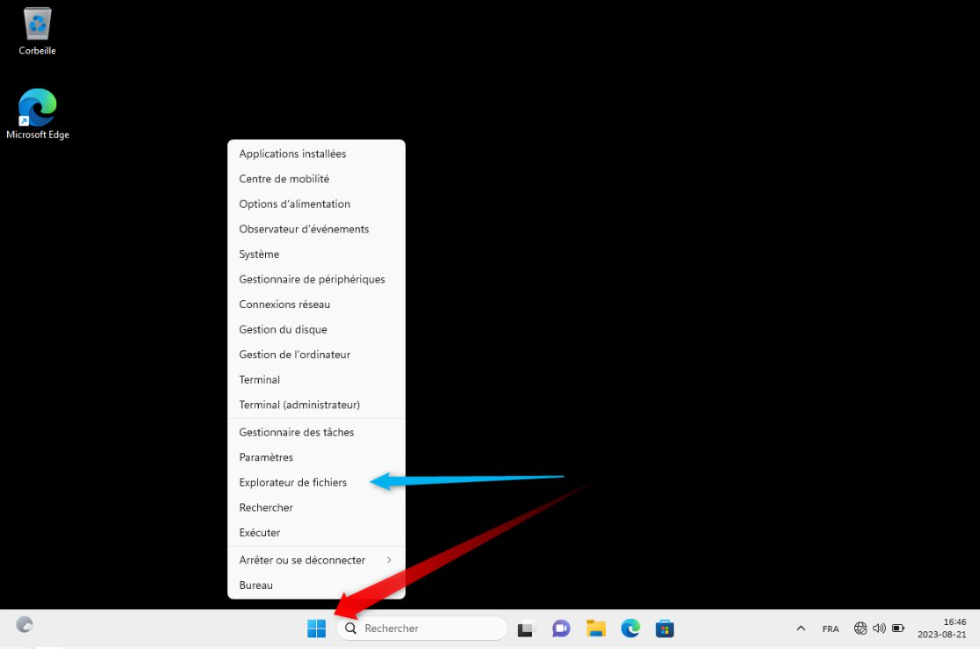

# Navigation de base en windows 11

## L'explorateur de fichier.

### Où trouver l'explorateur.

  
  
  
  
  

### Les options de l'explorateur.

### Ajouter et supprimer un accès rapide.

### Fichiers cachés.

### Raccourcis vers un fichier / dossier