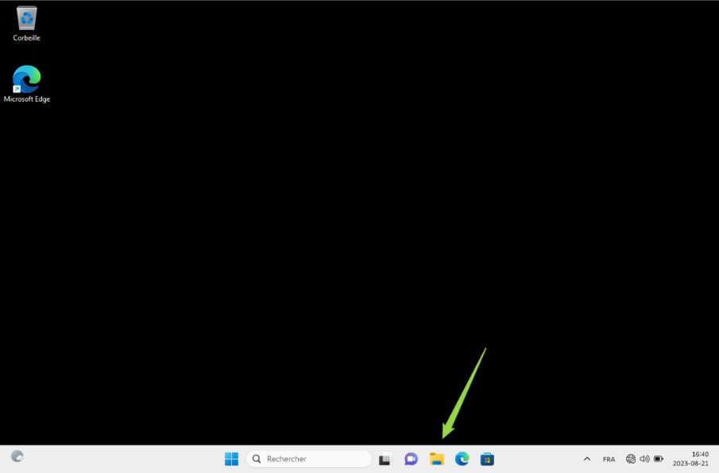
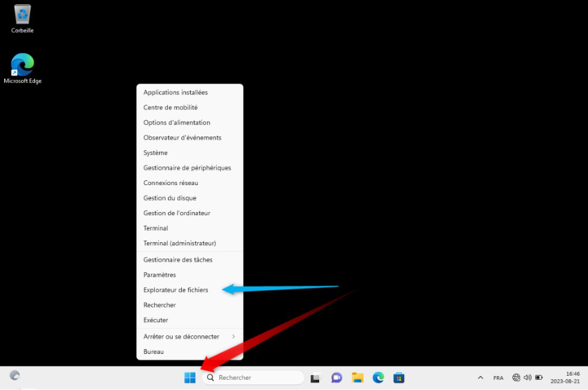
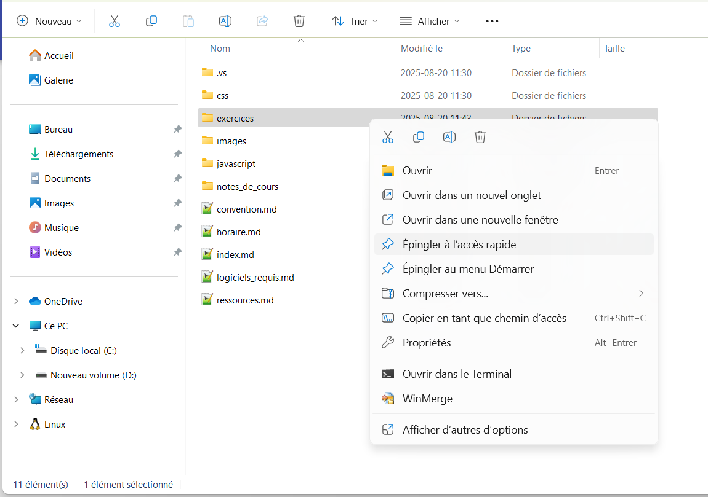
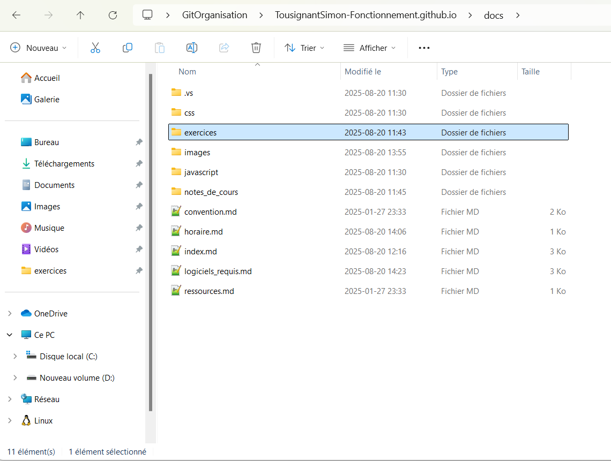
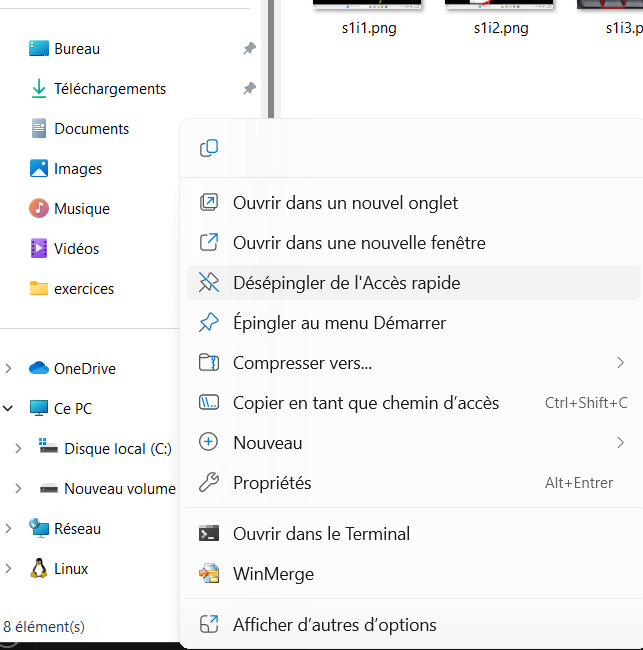

# Navigation de base en windows 11

## L'explorateur de fichier.

### Où trouver l'explorateur.

Via les racourcis graphique.  
  
Via le menu démarrer.  
  
Par raccourcis clavier.  
  
  
### Les dossier accès rapide
Par clique de droit sur un dossier, on peut épingler un dossier pour y avoir accès rapidement.  
    
Résultat :
  
    
Pour désépingler on clique également de droit sur le dossier.
  

# 🧭 Utilisation de l'explorateur Windows

---

## 📌 Raccourcis vers un fichier ou un dossier

Un **raccourci** est un lien rapide permettant d’ouvrir un fichier ou un dossier sans avoir à naviguer dans l’arborescence complète.

### ▶️ Créer un raccourci (clic droit) :

1. Fais un **clic droit** sur le fichier ou le dossier souhaité.
2. Clique sur **"Créer un raccourci"**.
3. Un raccourci est généré dans le même dossier, avec une icône spéciale.
4. Tu peux ensuite le **déplacer** (par exemple sur le Bureau).

> 🔄 Un raccourci **ne déplace ni ne copie** le fichier original : il pointe simplement vers celui-ci.

---

## 🏠 Dossier de l'utilisateur

Le **dossier utilisateur** est le répertoire personnel attribué à chaque session Windows. Il contient tous les dossiers standards : Documents, Bureau, Téléchargements, Images, etc.

### 📂 Emplacement typique :

C:\Users\nom_utilisateur\

### 📁 Contenu classique :
- **Bureau** (Desktop)
- **Documents** (Documents)
- **Téléchargements** (Downloads)
- **Images** (Pictures)
- **Vidéos** (Videos)
- **AppData** (dossier caché pour les données des applications)

> 🧠 Le dossier utilisateur est important car il centralise **toutes les données personnelles** d'un utilisateur.

---

## ⚙️ Les options de l’explorateur de fichiers

L’explorateur de fichiers Windows peut être personnalisé via le menu **"Options"**.

### 🔧 Accéder aux options :

1. Ouvrir un dossier (n'importe lequel)
2. Aller dans l’onglet **"Affichage"**
3. Cliquer sur **"Options"** → **"Modifier les options de dossier et de recherche"**

---

### Principales options utiles :

| Option                             | Effet                                                  |
|------------------------------------|---------------------------------------------------------|
| ✅ Afficher les fichiers cachés    | Permet de voir les fichiers/dossiers normalement invisibles |
| 🔓 Afficher les extensions         | Affiche l’extension (.txt, .exe, .jpg, etc.) des fichiers |
| 🔐 Ne pas masquer les fichiers protégés | Affiche les fichiers système (à manipuler avec précaution) |
| 🕘 Ouvrir dans ce PC / accès rapide | Détermine le dossier affiché par défaut au démarrage    |
| 📁 Ouvrir les dossiers dans de nouvelles fenêtres | Change le comportement des clics |

> ⚠️ Certaines options sont sensibles (fichiers système, extensions) → à activer avec prudence selon le niveau de l'utilisateur.

---

