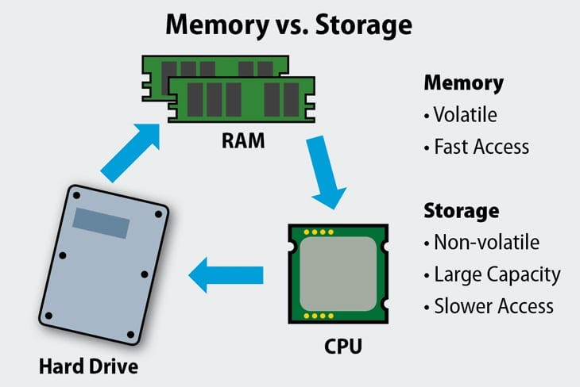

# Notes de cours – Matériel informatique

## 1. Composants principaux d’un ordinateur

| Composant                                     | Définition                                    | Rôle                                                                 |
| --------------------------------------------- | --------------------------------------------- | -------------------------------------------------------------------- |
| **Processeur (CPU)**                          | Unité centrale de traitement                  | Exécute les instructions des programmes et gère les calculs          |
| **Mémoire vive (RAM)**                        | Mémoire temporaire rapide                     | Stocke les données et programmes en cours d’utilisation              |
| **Carte mère**                                | Circuit imprimé principal                     | Connecte tous les composants et permet leur communication            |
| **Carte graphique (GPU)**                     | Processeur spécialisé pour le rendu graphique | Traite les images, vidéos et jeux 3D                                 |
| **Disque dur / SSD**                          | Support de stockage                           | Stocke les données et le système d’exploitation                      |
| **Boîtier**                                   | Enveloppe de l’ordinateur                     | Protège et organise les composants, permet un bon flux d’air         |
| **Alimentation (PSU)**                        | Fournit le courant électrique à l’ordinateur  | Convertit le courant secteur en tensions stables pour les composants |
| **Ventilateurs / système de refroidissement** | Dissipe la chaleur                            | Maintient les composants à une température sûre                      |
| **Périphériques (souris, clavier, écran)**    | Interface utilisateur                         | Permet l’interaction avec l’ordinateur                               |

---

## 2. Alimentation (PSU) et voltages

* **Rôles d’une alimentation** :

  * Convertir le courant alternatif (AC) de la prise murale en courant continu (DC) adapté aux composants
  * Distribuer différentes tensions :

    * **+3.3V** → RAM, certains circuits de la carte mère
    * **+5V** → périphériques, circuits logiques
    * **+12V** → CPU, GPU, moteurs des disques et ventilateurs
* **Normes courantes** : ATX, EPS
* **Puissance recommandée** : 300 W à 1000 W+ selon la configuration

### Sélection d’un bon boîtier d’alimentation

**Bonnes pratiques :**

* Choisir une alimentation **certifiée 80 PLUS** (efficacité énergétique)
* Vérifier la puissance totale nécessaire avec un **calculateur PSU**
* Privilégier les PSU **modulaires** pour une meilleure gestion des câbles
* Choisir des marques reconnues pour la qualité et la sécurité électrique

**Marques généralement reconnues :**

* Corsair
* Seasonic
* EVGA
* Be Quiet!
* Cooler Master

---

## 3. Disques durs (HDD)

### 3.1 Disques mécaniques

* **Définition** : Disque utilisant des plateaux magnétiques rotatifs et une tête de lecture/écriture mobile
* **Tailles courantes** : 3,5" (bureau), 2,5" (portable)
* **Capacité** : 500 Go à 20 To
* **Vitesse** : 5400 RPM, 7200 RPM, 10 000 RPM
* **Force** : Prix faible par Go, stockage massif
* **Faiblesse** : Lent comparé aux SSD, bruit, consommation d’énergie, fragilité mécanique
* **Disques hybrides (SSHD)** : combinaison HDD + cache SSD pour améliorer la performance

---

## 4. Disques SSD M.2

### 4.1 M.2 SATA

* Utilise le **bus SATA** classique
* Vitesse limitée à \~550 Mo/s
* Compatible avec les emplacements M.2 SATA sur la carte mère

### 4.2 M.2 NVMe / PCIe

* Utilise le **bus PCI Express**
* Vitesse de lecture/écriture : jusqu’à 7000 Mo/s selon la génération (PCIe 3.0, 4.0, 5.0)
* Moins limité par le protocole SATA, plus rapide pour les jeux et le montage vidéo
* Taille physique : 2280 (22 mm x 80 mm) courante
* Attention à la **compatibilité avec la carte mère** (NVMe PCIe vs SATA M.2)

**Avantages des SSD M.2 NVMe :**

* Très rapide
* Sans bruit
* Faible consommation
* Idéal pour le système d’exploitation et les applications

**Inconvénients :**

* Plus cher que HDD par Go
* Capacité souvent plus limitée que les gros HDD

## Matériel informatique avec illustrations

Voici la liste des composantes avec leurs images et descriptions.

### Carte mère

**Définition :** Circuit imprimé principal de l’ordinateur.
**Rôle :** Connecter tous les composants et permettre leur communication.

### CPU (Processeur)

**Définition :** Unité centrale de traitement.
**Rôle :** Exécute les instructions des programmes et gère les calculs.

### Mémoire vive (RAM : Random Access Memory)

**Définition :** Mémoire temporaire rapide.  
**Rôle :** Stocke les données et programmes en cours d’utilisation.

### Stockage long terme 
Historique des disques  
* Disque conventionnel (hdd : hard disk drive)

* Disque ssd (solid state drive)

* L'arrivé des m2 (actuel et moderne) 
La version pci-e  

La version sata  

* un Frankeinstein de convertisseur pour avoir plus de disque sata via m2

[Explications](https://www.kingston.com/fr/blog/pc-performance/two-types-m2-vs-ssd)

### Carte graphique (GPU)

**Définition :** Processeur spécialisé pour le rendu graphique.
**Rôle :** Traite les images, vidéos et jeux 3D.

### Carte son professionnelle

**Définition :** Carte dédiée au traitement audio.
**Rôle :** Fournit une meilleure qualité sonore et des options audio avancées.

### Dissipateur de chaleur

**Définition :** Dispositif de refroidissement.
**Rôle :** Dissipe la chaleur pour maintenir les composants à température sûre.

### Alimentation (PSU)

**Définition :** Fournit le courant électrique à l’ordinateur.  
**Rôle :** Convertit le courant secteur en tensions stables pour les composants.

### Cartes d'extension pour disques PCIe & M.2
Carte d'extension pour avoir plus de disque M.2 si on a des ports pci-express disponible (1x)

Carte d'extension pour ajouter des ports sata via une extension pci-e 1x

**Définition :** Supports de stockage modernes (SSD) utilisant le bus PCIe ou SATA.
**Rôle :** Stocker les données avec des performances supérieures aux disques mécaniques.

### Carte d'extension série

** Définition : ** Carte pour interragir avec du matériel à un niveau plus de base. 
** Rôle **Souvent en industrie, ou pour s'interfacer avec des micro-controlleurs ou des ordinateurs spécialisé dans du matériel. Exemple OBD2 est un format pour discuter avec l'ordinateur d'une voiture.

